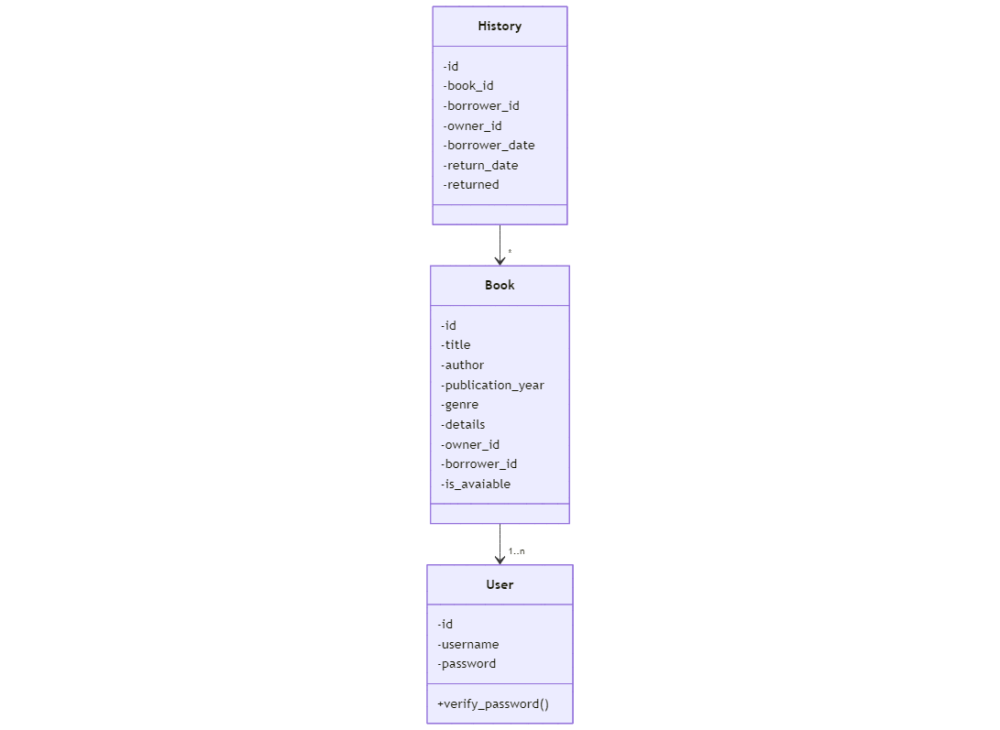

# Sistema de Empréstimo de Livros
**Escopo do Sistema**: O objetivo é criar uma plataforma intuitiva onde usuários possam
disponibilizar seus livros para empréstimo, e pegar emprestado livros que já estejam disponíveis
na plataforma. O sistema deve mostrar para o usuário seu histórico de
empréstimos e respectivos prazos de entrega.
Primeiro, o usuário deve se cadastrar na plataforma ou fazer o login. Com isso, ele será redirecionado para uma página inicial onde terá quatro opções: cadastrar e disponibilizar novos livros para empréstimo; poder ver seus livros cadastrados; entrar numa nova página para pegar livros emprestados; ver os livros que já pegou emprestado com o histórico e suas datas.
Dessa forma, cada opção terá as seguintes features:
 - Primeira opção de cadastrar novos livros: será uma simples página com um formulário onde a pessoa preenche os dados do livro e um botão que confirma o cadastro.
 - Segunda opção para visualizar seus livros cadastrados: será uma página contendo todos os livros do usuário num estilo de tabela, onde cada coluna vai ter as principais informações do usuário e as ações possíveis (editar / deletar um livro / indicar que ele está disponível para empréstimo de novo).
 - Na terceira opção: teremos uma nova página com um estilo também parecido com uma tabela, mas será possível aplicar filtros para facilitar a busca por livros específicos. Ao pegar um livro emprestado, ele sairá da lista e não fica mais disponível para novos usuários.
 - Por fim, quarta opção, com o histórico do usuário de livros emprestados: teremos a lista de livros ordenados por data de devolução mais próxima.

# Membros da Equipe
- **Israel de Melo Pedrosa** - Fullstack developer
- **Rodrigo Reis de Sá Guimarães Cabral** - Fullstack developer 
- **Thiago de Assis Lima** - Fullstack developer
- **Bernardo Alves Costa Pereira** - Fullstack developer
  
# Tecnologias
  HTML
  CSS
  SQLite
  Python (_Flask_)

# Backlog do produto
1. Como usuário, eu gostaria de me cadastrar na plataforma para utilizar o sistema de empréstimos de livros (CRUD de usuário).
2. Como usuário, eu gostaria de cadastrar novos livros para que outras pessoas possam pegá-los emprestados (CRUD de livros).
3. Como usuário, eu gostaria de ver todos os livros que eu cadastrei e gerenciar sua disponibilidade.
4. Como usuário, eu gostaria de pegar livros emprestados, aplicando filtros para facilitar minha busca.
5. Como usuário, eu gostaria de ver o histórico dos livros que já peguei emprestado, ordenados por data de devolução.
6. Como usuário, eu gostaria de receber notificações sobre prazos de devolução dos livros que peguei emprestado.
7. Como usuário, eu gostaria de avaliar livros que peguei emprestado para ajudar outros usuários na escolha.
8. Como usuário, eu gostaria de favoritar livros para que possa pegá-los emprestados no futuro.
9. Como usuário, eu gostaria de ver estatísticas pessoais, como quantos livros já emprestei e quantos peguei emprestado.
10. Como usuário, eu gostaria de compartilhar um link dos livros que estou disponibilizando para que outras pessoas possam visualizá-los.

# Sprint 1
## História #1: CRUD de Usuário
- Configurar o ambiente com Flask e SQLite - [Rodrigo]
- Criar tabelas de usuários no banco de dados (SQLite) - [Israel]
- Implementar a criação de usuário no backend (Flask) - [Bernardo]
- Criar a tela de cadastro de usuário no frontend (HTML/CSS) - [Thiago]
- Implementar autenticação de login no backend (Flask) - [Thiago]
- Integrar a tela de cadastro/login com o backend - [Rodrigo]

## História #2: CRUD de Livros
- Criar tabelas de livros no banco de dados (SQLite) - [Thiago]
- Implementar a lógica de cadastro de livros no backend (Flask) - [Israel]
- Criar a tela de cadastro de livros no frontend (HTML/CSS) - [Rodrigo]
- Implementar a lógica de edição/deleção de livros no backend (Flask) - [Bernardo]
- Integrar o frontend de cadastro/edição com o backend - [Israel]

## História #3: Ver Todos os Livros e Gerenciar Disponibilidade
- Criar a página de visualização dos livros cadastrados no frontend (HTML/CSS) - [Bernardo]
- Implementar a lógica de visualização dos livros no backend (Flask) - [Thiago]
- Adicionar funcionalidade de gerenciamento de disponibilidade no backend - [Rodrigo]
- Integrar a página de visualização e gerenciamento com o backend - [Israel]

## História #4: Pegar Livros Emprestados com Filtros
- Criar a página de busca de livros com filtros no frontend (HTML/CSS) - [Israel]
- Implementar os filtros de busca de livros no backend (Flask) - [Rodrigo]
- Criar a lógica de pegar livros emprestados no backend - [Thiago]
- Integrar a busca e os filtros com o backend - [Bernardo]

## Diagrama de Atividades
  

   
  

## Diagrama de Classes
  

   
  

